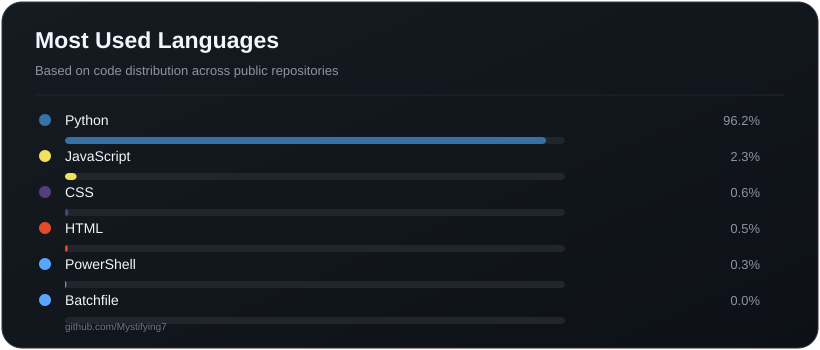
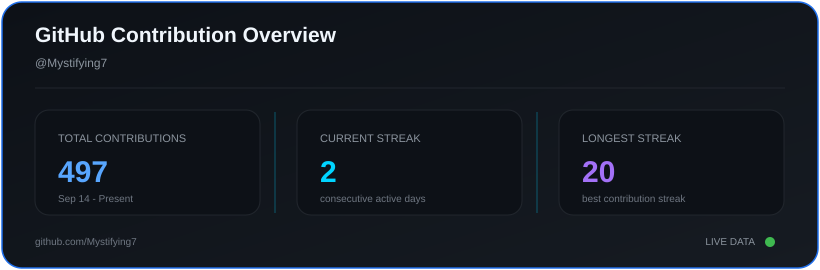

  

  
  

  
  
  
  

  
  
  

---

### 👨‍💻 About Me

I am an enthusiastic 5th-semester Computer Science Engineering student diving deep into the world of Artificial Intelligence, Machine Learning, and Full-Stack Development. My focus is on writing clean, efficient code in C, Java, and Python while building real-world projects that solve actual problems. With a growing foundation in data structures, predictive modeling, and hardware-software integration, I am actively bridging the gap between theoretical computer science and practical software engineering.

**Open To:** Entry-level software engineering roles, tech support collaborations, open-source contributions, and exciting AI/ML projects.

---

### 💻 Tech Stack & Tooling

  <strong>Languages</strong> 
  

  <strong>Frontend Integration</strong> 
  

  <strong>Backend & Databases</strong> 
  

  <strong>Cloud, DevOps & Tooling</strong> 
  

---

### 🧠 AI / ML Expertise

| Domain | Proficiency | Core Technologies & Details |
| :--- | :---: | :--- |
| **Computer Vision** | Intermediate | Real-time object tracking, HCI, OpenCV, Hand-tracking algorithms. |
| **Predictive Modeling** | Intermediate | Scikit-Learn, Regression models, Feature engineering for real estate. |
| **Data Handling** | Intermediate | Data wrangling, NumPy, Pandas, Data Structures. |
| **Algorithm Design** | Growing | Core algorithmic problem solving, Logic optimization. |

---

### 📁 Featured Projects

<b>🛡️ Kavacham</b>

 
Cyber Security & Data Privacy — Detect outbound exposure and inspect APK risk.

| Category | Details |
| :--- | :--- |
| **Stack** | Python, Security Tooling, Encrypted Logging |
| **Scale** | Application-level monitoring |
| **Performance** | Efficient background data inspection |
| **Security** | Preserves encrypted evidence, secure erasure protocols |
| **Impact** | Organizes reviewable escalation timelines for personal data privacy |
| **Repository** | [View on GitHub](https://github.com/hackerskr76/Kavacham-Citadel1.0) |
| **Image** | | 

**Project Explanation:** Built a data privacy utility capable of evaluating outbound network exposures. The application incorporates encrypted logging to secure forensic evidence and structures an automated escalation timeline, helping users maintain strict control over their digital footprint.

🔍 <b>SmartDoc AI</b>

 

**Generative AI & Information Retrieval** — Precision technical search and hallucination-free documentation synthesis.

| Category | Details |
| :--- | :--- |
| **Stack** | Python, FastAPI, FAISS, BM25, SentenceTransformers, Groq (Llama 3), HTML/JS |
| **Scale** | Corpus-wide multi-document indexing with sub-second hybrid retrieval |
| **Performance** | Two-stage retrieve-and-rerank pipeline with neural Cross-Encoder scoring |
| **Security** | Zero-hallucination guardrails with deterministic context grounding |
| **Impact** | Automates technical knowledge discovery with auditable source citations |
| **Repository** | [View on GitHub](https://github.com/Mystifying7/hybrid_rag_project) |
| **Image** |  |

**Project Explanation:** Built an enterprise-grade hybrid retrieval-augmented generation (RAG) system combining BM25 lexical search and FAISS dense vector embeddings with Reciprocal Rank Fusion (RRF). The system integrates a Cross-Encoder neural reranker and strict LLM guardrails to deliver accurate, fully cited technical answers without hallucinations.

<b>🏢 PROP_ENGINE.ai</b>

 
Full-Stack PropTech — Real-time real estate valuations powered by Machine Learning.

| Category | Details |
| :--- | :--- |
| **Stack** | Python, Scikit-Learn, Web Frontend |
| **Scale** | Targeted at major Indian real estate markets |
| **Performance** | Quick inference generation for accurate valuations |
| **Security** | Web API input validation |
| **Impact** | Provides transparent property pricing using historical data vectors |
| **Repository** | [View on GitHub](https://github.com/Mystifying7/House_Price_Project) |
| **Live** | [Live](https://house-price-project-ten.vercel.app/) |
| **Image** |  | 

**Project Explanation:** Engineered a predictive platform using supervised Machine Learning algorithms. By processing structured historical real estate data, the application successfully delivers dynamic and highly accurate property valuations through an accessible web interface.

<b>🏎️ Virtual-Steering-Wheel-Master</b>

 
Computer Vision & HCI — Low-latency virtual steering controls.

| Category | Details |
| :--- | :--- |
| **Stack** | Python, OpenCV, Mediapipe |
| **Scale** | Local runtime processing |
| **Performance** | Seamless real-time video tracking |
| **Security** | Operates safely on-device |
| **Impact** | Replaces physical controllers with spatial tracking mechanics |
| **Repository** | [View on GitHub](https://github.com/Mystifying7/virtual-steering-wheel-master) |
| **Image** |  |

**Project Explanation:** Designed an innovative Human-Computer Interaction module utilizing computer vision. This system tracks hand movements via webcam and uses real-time trigonometric translation to perfectly emulate physical steering wheel inputs for gaming.

<b>🖐️ Air-Cursor</b>

 
Gesture-Controlled Interface — Hands-free spatial navigation for web interfaces.

| Category | Details |
| :--- | :--- |
| **Stack** | Python, OpenCV, WebSockets, Vanilla JS |
| **Scale** | Interactive web integration |
| **Performance** | Asynchronous bidirectional data flow |
| **Security** | Local WSS endpoint security |
| **Impact** | Pushes the boundaries of accessible UI navigation |
| **Repository** | [View on GitHub](https://github.com/Mystifying7/AirCursor) |
| **Image** |  |

**Project Explanation:** Developed a hands-free navigation tool that pairs a Python-based computer vision backend with a JavaScript web frontend. The system relies on WebSockets to map hand gestures to real-time DOM interactions, completely bypassing the need for a physical mouse.

<b>🎬 CineMind AI</b>

 
AI-Powered Recommendation Engine — Content-based movie discovery driven by NLP & Cosine Similarity.

| Category | Details |
| :--- | :--- |
| **Stack** | Python, FastAPI, Scikit-Learn, Pandas, Vanilla JS |
| **Scale** | 4,800+ movies dataset processing |
| **Performance** | High-speed vector similarity matrix calculations |
| **Architecture** | Decoupled RESTful API with LocalStorage state management |
| **Impact** | Instant, personalized film discovery with interactive glassmorphism UI |
| **Repository** | [View on GitHub](https://github.com/Mystifying7/Movie--Recommender) |
| **Image** |   |

**Project Explanation:** Built an end-to-end content-based movie recommendation system that utilizes NLP (CountVectorizer & PorterStemmer) and Cosine Similarity to calculate real-time similarity scores across 4,800+ films. Features a high-performance FastAPI backend paired with a responsive Vanilla JS frontend with autocomplete search, dynamic TMDB poster rendering, and watchlist persistence.

---

### 🚀 Coding Profiles

  

---

### 🏆 Achievements & GitHub Stats

  

  

---

  <em>Thank you for visiting my profile! Feel free to reach out for collaborations.</em>

